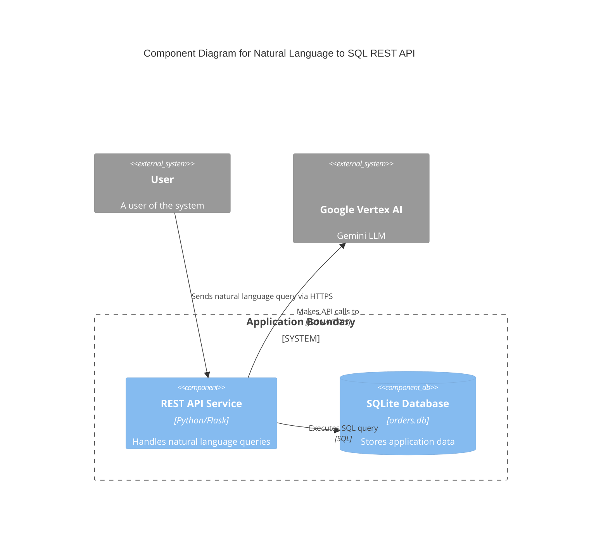

# Software Architecture Document: Natural Language to SQL REST API

**Note:** This document was automatically derived (reverse-engineered) using AI based on the app's codebase.

## 1. Architectural Style

The application follows a **Client-Server** architectural style.

**Justification:**
The application is composed of a server that provides a RESTful API endpoint for processing natural language queries. Clients can interact with this server by sending HTTP requests, and the server responds with the results of the database query. This separation of concerns between the client and server is a key characteristic of the Client-Server style.

## 2. Component Breakdown

*   **REST API Service:**
    *   **Responsibility:** Exposes a `/query` endpoint that accepts natural language questions, interacts with the Google Vertex AI service to convert them into SQL queries, and executes the queries against the local database.
*   **Google Vertex AI (Gemini):**
    *   **Responsibility:** A cloud-based machine learning platform that provides the natural language processing capabilities to convert questions into SQL queries.
*   **SQLite Database:**
    *   **Responsibility:** A local, file-based database that stores the application's data and is queried by the REST API service.

## 3. Component Interaction Diagram (Mermaid)

## 4. Technology Stack

*   **Backend:** Python, Flask
*   **Database:** SQLite
*   **Machine Learning:** Google Vertex AI (Gemini)
*   **Dependencies:** google-cloud-vertexai, google-api-core

## 5. Data Flow Example: User Query

1.  **User** sends a POST request with a natural language question to the `/query` endpoint on the **REST API Service**.
2.  The **REST API Service** constructs a prompt containing the user's question and the database schema.
3.  The **REST API Service** sends the prompt to the **Google Vertex AI** service.
4.  **Google Vertex AI** returns a SQL query to the **REST API Service**.
5.  The **REST API Service** executes the SQL query against the **SQLite Database**.
6.  The **SQLite Database** returns the query results to the **REST API Service**.
7.  The **REST API Service** formats the results as JSON and returns them to the **User**.

## 6. Deployment and Infrastructure

*   **Build:** The application is run directly from the Python source files. The required dependencies are listed in `requirements.txt` and can be installed using `pip`.
*   **Containerization:** There is no evidence of containerization in the provided files.
*   **Deployment:** The application is deployed by running the `restapi_service.py` script directly. The `README.md` file provides instructions on how to run the service.

## 7. Key Design Decisions

*   **Decision:** Use of a local SQLite database.
    *   **Rationale:** This simplifies the setup and deployment of the application, as it does not require a separate database server. This is suitable for a proof-of-concept or small-scale application.
*   **Decision:** Use of Google Vertex AI for natural language to SQL conversion.
    *   **Rationale:** This leverages a powerful, cloud-based machine learning model to perform the complex task of converting natural language to SQL, avoiding the need to build and train a custom model.
*   **Decision:** Stateless API with no authentication.
    *   **Rationale:** The `README.md` explicitly states that the focus of the application is to demonstrate the natural language to SQL conversion, not to implement a production-ready authentication system. This simplifies the development and testing of the core functionality.
